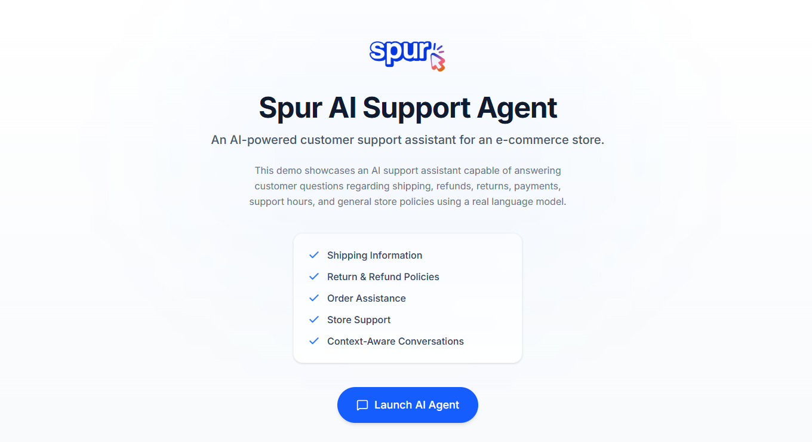
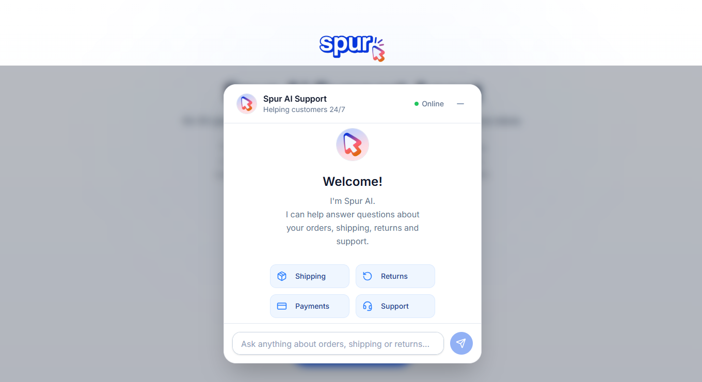
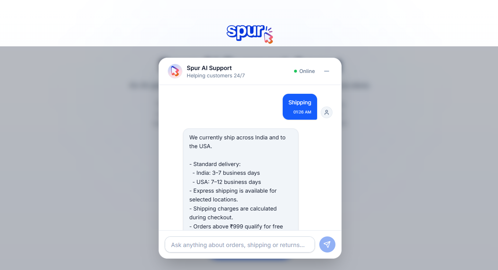
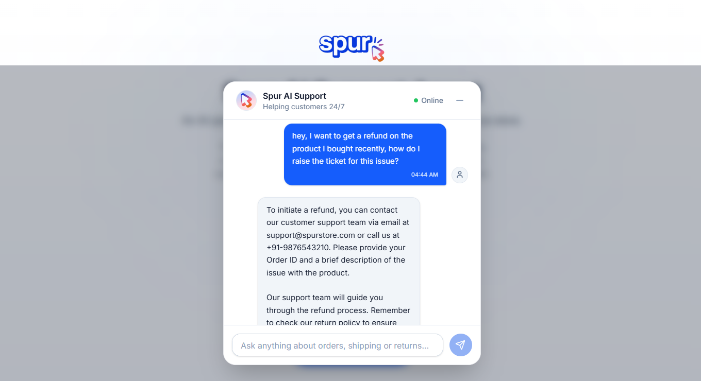

# Spur AI Support Agent

An intelligent, full-stack customer support chat application backed by a real LLM. This project serves as a submission for the **Spur Founding Full-Stack Engineer Hiring Assignment**.

## Overview

Spur AI Live Chat Agent simulates a seamless customer support experience. Users can converse with a e-commerce store assistant that answers questions, maintains context over multiple turns, and remembers previous sessions. Under the hood, it leverages ultra-low latency inference via Groq, permanent persistence with PostgreSQL, and high-performance caching through Redis.

## Features

- **AI-Powered Chat:** Real-time conversational interface backed by Groq's `llama-3.3-70b-versatile` model.
- **Persistent Conversations:** All chat sessions and messages are permanently stored in PostgreSQL.
- **Session-Based History:** Conversations are tied to unique session IDs, allowing users to resume chats seamlessly.
- **Redis Caching:** Write-through cache architecture ensuring lightning-fast history retrieval without hitting the database.
- **Knowledge-Based Responses:** The LLM is statically injected with custom domain knowledge to accurately answer store-specific FAQs.
- **AI Guardrails:** Strict system prompts keep the AI assistant polite, concise, and focused purely on customer support.
- **Prompt Engineering:** Dynamic context window management combining system rules, FAQ knowledge, and chat history.
- **Rate Limiting:** IP-based request throttling using Redis to protect the AI endpoints.
- **Global Error Handling:** Centralized, secure error interception that degrades gracefully without leaking internal stacks.
- **Responsive Frontend:** A modern, polished React interface with auto-scrolling, typing indicators, and empty states.
- **Clean Architecture:** Strict separation of concerns across routes, controllers, services, and data repositories.

## Tech Stack

| Layer | Technology |
|---|---|
| **Frontend** | React, TypeScript, Vite, Tailwind CSS, Axios |
| **Backend** | Node.js, Express, TypeScript |
| **Database** | PostgreSQL |
| **ORM** | Prisma |
| **Cache / Rate Limiting** | Redis (Upstash) + ioredis |
| **LLM Provider** | Groq (`llama-3.3-70b-versatile`) |
| **Validation** | Zod |
| **Language** | TypeScript (End-to-end) |
| **Deployment** | Netlify (Frontend), Render (Backend) |

## Architecture

The application strictly separates the client interface from the business logic and data persistence layers.

```text
       User (Browser)
             │
             ▼
    Frontend (React UI)
             │
             ▼
   Backend API (Express)
             │
             ├──► Rate Limiter & Validation (Zod)
             │
             ▼
        Controllers
             │
             ▼
    Services (Business Logic)
      │      │      │
      ▼      ▼      ▼
    Groq   Redis   Prisma
   (LLM)  (Cache) (Postgres)
```
- **Frontend**: Manages UI state, session IDs, and renders chat bubbles natively.
- **Express / Controllers**: Orchestrates incoming requests, applies validation, and handles HTTP responses.
- **Services**: Contains the core logic for prompt building, cache manipulation, and database access.
- **Groq**: Generates the AI responses based on the injected context.
- **Redis**: Stores rate-limit counters and caches recent chat histories for rapid reads.
- **PostgreSQL**: Serves as the ultimate source of truth for all sessions and messages.

## Project Structure

```text
/
├── frontend/    # React SPA containing the chat interface and UI components
├── backend/     # Express API handling LLM generation, caching, and persistence
└── README.md    # This root documentation file
```

## Getting Started

To run this project locally, you will need Node.js, a PostgreSQL database, and a Redis instance (or Upstash account).

1. **Clone the repository:**
   ```bash
   git clone https://github.com/cyphering101Raman/Agent-Support-Spur.git
   ```

2. **Configure Environment Variables:**
   Create `.env` files in both the `frontend/` and `backend/` directories. Refer to their respective documentation for required keys (e.g., `GROQ_API_KEY`, `PRISMA_URL`, `REDIS_URL`, etc.).

3. **Install & Run Backend:**
   ```bash
   cd backend
   npm install
   npx prisma generate
   npx prisma db push
   npm run dev
   ```

4. **Install & Run Frontend:**
   ```bash
   cd ../frontend
   npm install
   npm run dev
   ```

For detailed installation instructions, please see the individual folder documentation:
- [Backend Documentation](./backend/README.md)
- [Frontend Documentation](./frontend/README.md)

## Screenshots


### Chat Interface


### AI Responses




## Assignment Requirements Covered

-  **AI Chat:** Integration with a real LLM (Groq) for conversational responses.
- **Conversation Persistence:** All chats are saved to PostgreSQL.
- **FAQ Knowledge Base:** LLM accurately answers questions based on injected domain knowledge.
- **Session History:** Users can resume past conversations.
- **Prompt Engineering:** Custom system prompts and guardrails implemented.
- **Validation:** Zod schemas validate all incoming API payloads.
- **Error Handling:** Centralized global middleware catches and sanitizes errors.
- **Redis Caching:** Write-through cache architecture for lightning-fast history loading.
- **Rate Limiting:** IP-based request tracking via Redis.

## Documentation

For a deep dive into the code architecture, API endpoints, and design decisions, please refer to:
- [Frontend README](./frontend/README.md)
- [Backend README](./backend/README.md)

## License
MIT License
